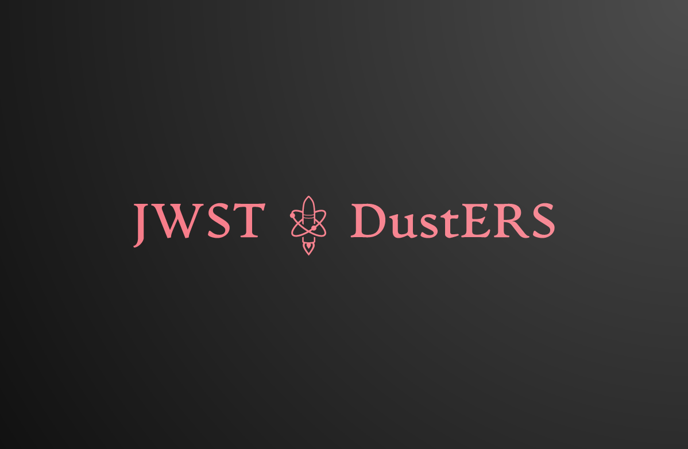

# JWST-DustERS

This repository contains python notebooks and tools to analyze the data from the JWST DustERS Early Release Science program.

**JWST requires Python 3.6 or above for dependencies.**

**Linux and MacOS platforms are tested and supported.**

## Abstract
Dust is a key ingredient in the formation of stars and planets. However, the dominant channels of dust production throughout cosmic time are still unclear. With its unprecedented sensitivity and spatial resolution in the mid-IR, the James Webb Space Telescope (JWST) is the ideal platform to address this issue by investigating the dust abundance, composition, and production rates of various dusty sources. In particular, colliding-wind Wolf-Rayet (WR) binaries are efficient dust producers in the local Universe, and likely existed in the earliest galaxies. To study these interesting objects, we propose JWST observations of the archetypal colliding-wind binary WR 140 to study its dust composition, abundance, and formation mechanisms. We will utilize two key JWST observing modes with the medium-resolution spectrometer (MRS) on the Mid-Infrared Instrument (MIRI) and the Aperture Masking Interferometry (AMI) mode with the Near Infrared Imager and Slitless Spectrograph (NIRISS).

Our proposed observations will yield high impact scientific results on the dust forming properties WR binaries, and establish a benchmark for key observing modes for imaging bright sources with faint extended emission. This will be valuable in various astrophysical contexts including mass-loss from evolved stars, dusty tori around active galactic nuclei, and protoplanetary disks. We are committed to designing and delivering science-enabling products for the JWST community that address technical issues such as bright source artifacts that will limit the maximum achievable image contrast.

## Installation

Download the git repository as a zip file or use "git clone" in your terminal (in the desired directory) to create a local copy of the repository as a folder. The latter option allows you to easily update your version of the repository using "git pull".

    cd <your_directory/>
    git clone https://github.com/YannisArgyriou/JWST-DustERS.git

Updating your own clone of the IvS python repository to the most recent version can be done with:

    cd JWST-DustERS/
    git pull

The JWST-DustERS repository comes with an Anaconda python environment file to help avoid user problems with python module version. To create the repository anaconda environment run the following commands:

    cd ivs
    conda env create -f dusters_repo_3.6.yml

Make sure to activate your environment each time before using the repository:

    conda activate dusters_repo_3.6

## I have a bug/issue (or a fix/improvement):

Please let us know via the Issues tab on the Github page: https://github.com/YannisArgyriou/JWST-DustERS/issues
